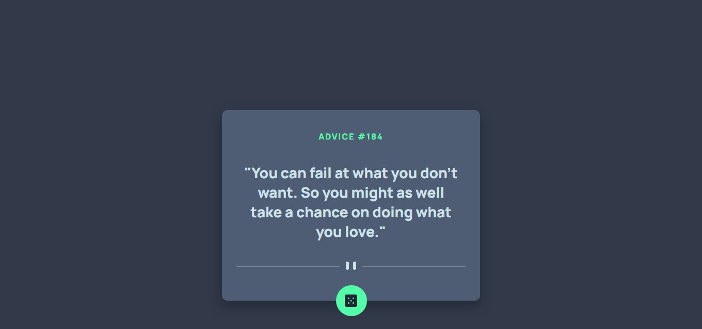

# Frontend Mentor - Advice generator app solution

This is a solution to the [Advice generator app challenge on Frontend Mentor](https://www.frontendmentor.io/challenges/advice-generator-app-QdUG-13db). Frontend Mentor challenges help you improve your coding skills by building realistic projects.

## Table of contents

- [Frontend Mentor - Advice generator app solution](#frontend-mentor---advice-generator-app-solution)
  - [Table of contents](#table-of-contents)
    - [Screenshot](#screenshot)
  - [Overview](#overview)
    - [The challenge](#the-challenge)
    - [Links](#links)
  - [My process](#my-process)
    - [Built with](#built-with)
    - [Continued development](#continued-development)
  - [Author](#author)

### Screenshot

## Overview

### The challenge

Users should be able to:

- View the optimal layout for the site depending on their device's screen size
- See hover states for all interactive elements on the page
- Toggle color theme to their preference

### Links

- Solution URL: [Solution](https://www.frontendmentor.io/solutions/advice-generator-with-react-completely-responsive-wd5Mow7tp)
- Live Site URL: [Live Preview](https://advice-generator-app-anthonyrosman.netlify.app/)

## My process

### Built with

- Semantic HTML5 markup
- CSS custom properties
- Flexbox
- CSS Grid
- Desktop-first workflow
- [React](https://reactjs.org/) - JS library

### Continued development

I keep practicing all my knowledge about react doing challenges in the frontend mentor no matter how difficult it is, I feel like I learn a lot more, my recommendation is to practice and practice.

## Author

- Frontend Mentor - [@D3press3dd](https://www.frontendmentor.io/profile/D3press3dd)
